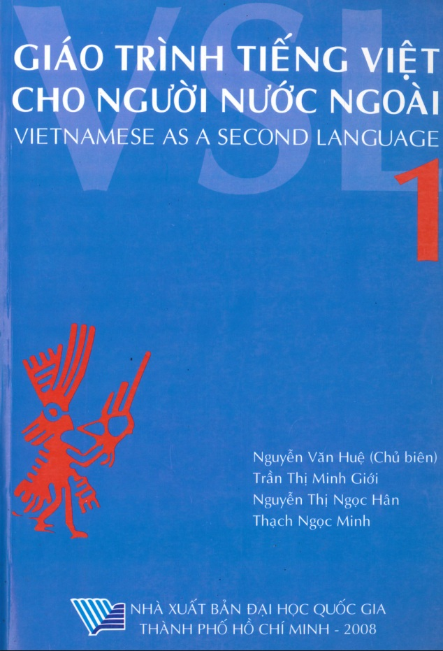
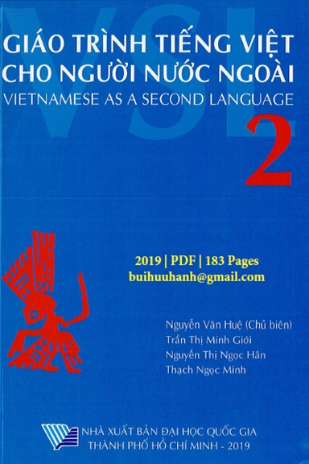
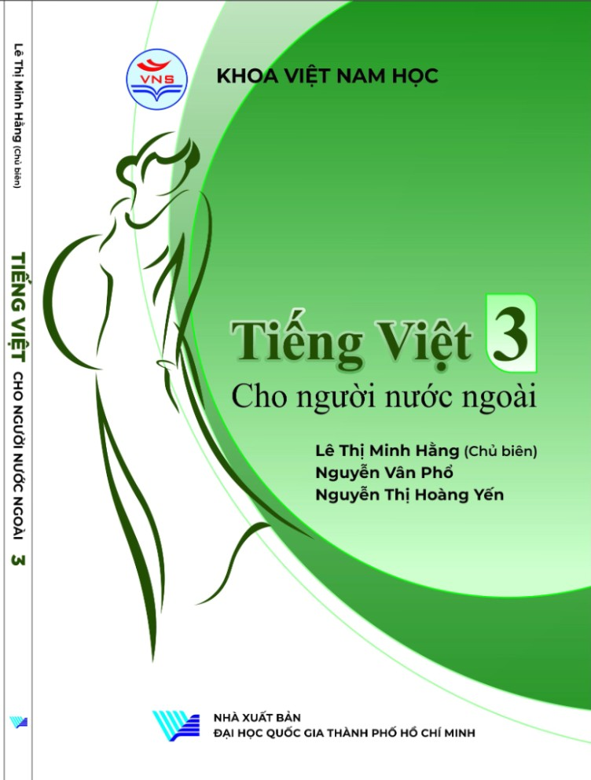
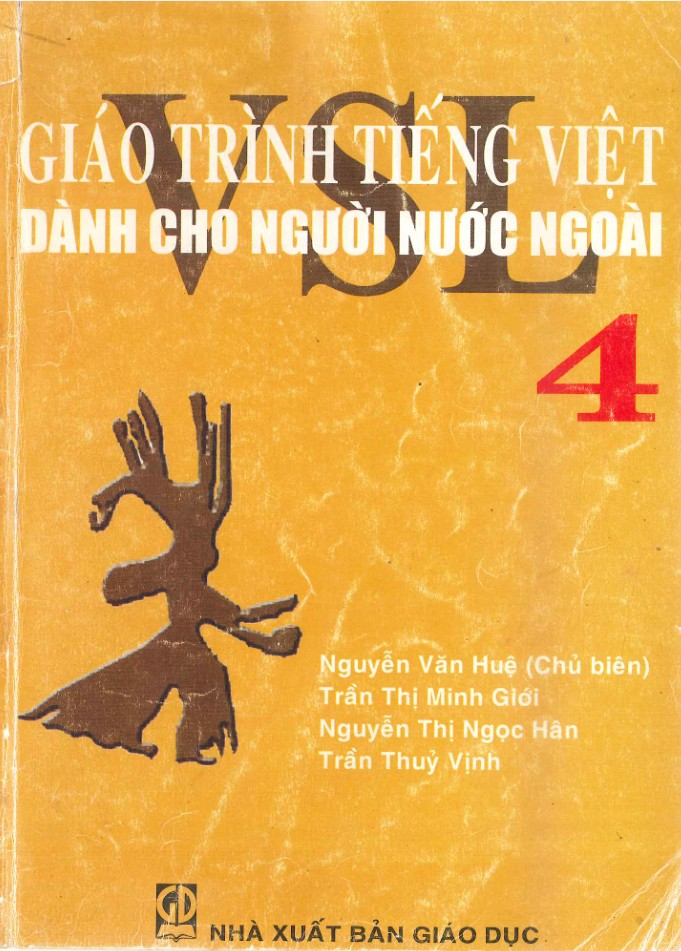

# vietnamese

Collect vocabulary, grammar and resources to learn Vietnamese.

## Books

### University of Social Sciences and Humanities, hcmussh.edu.vn or VNUHCM

- VSL1 from 2016 [link to pdf](books/VSL1/VSL1_2016.pdf) 11 pages, 2019
- VSL2 from 2012, 2019 [link to pdf](books//VSL2/VSL2_2019.pdf) 183 pages
- VSL3 from 2005 [link to pdf](books/VSL3/VSL3.pdf) 11 pages
- VSL4 from 2004 [link to pdf](books/VSL4/VSL4.pdf) 131 pages

   

An excerpt of the first 6 pages can be viewed online at [https://vlc.hcmussh.edu.vn/index.php/books/](https://vlc.hcmussh.edu.vn/index.php/books/).

### University of Education HCM, hcmue.edu.vn

- Tiếng Việt cho Người Nước Ngoài TVCNNN1
- Tiếng Việt cho Người Nước Ngoài TVCNNN2
- Tiếng Việt cho Người Nước Ngoài TVCNNN3

## Dictionary

I created it from the books provided by hcmue. A script will update the vocabulary counter.

## Grammar

Again copied from the 3 books of HCMUE and the first 3 books that are updated. Converted to markdown.
